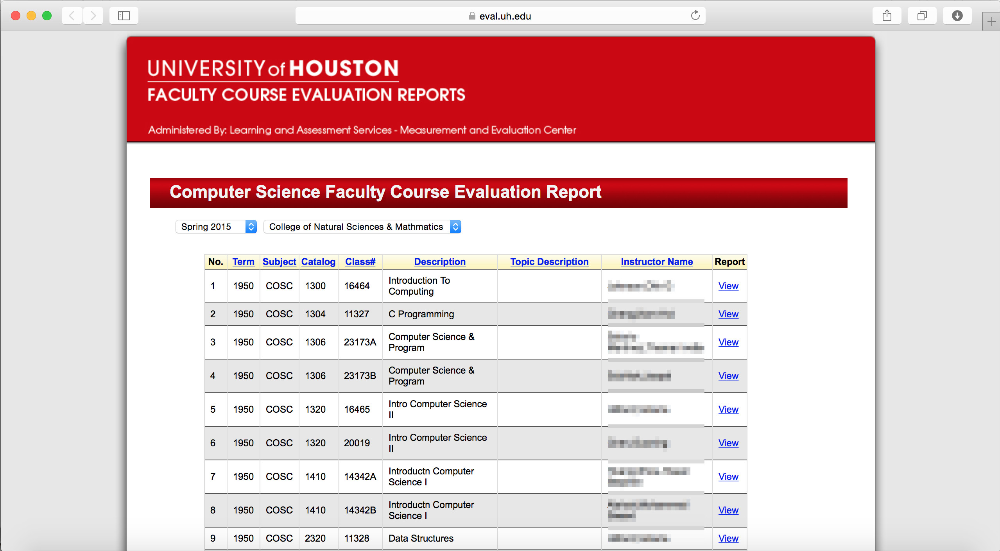
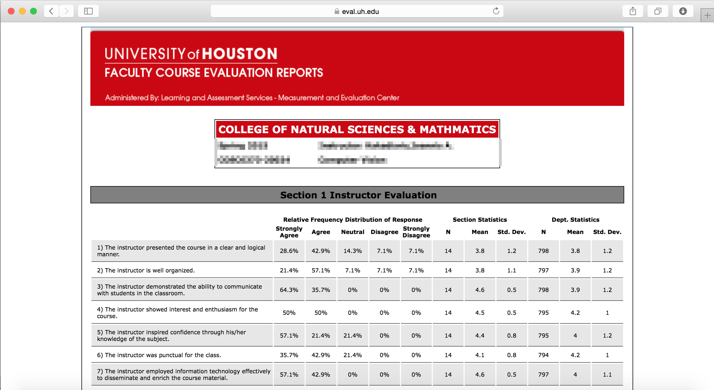
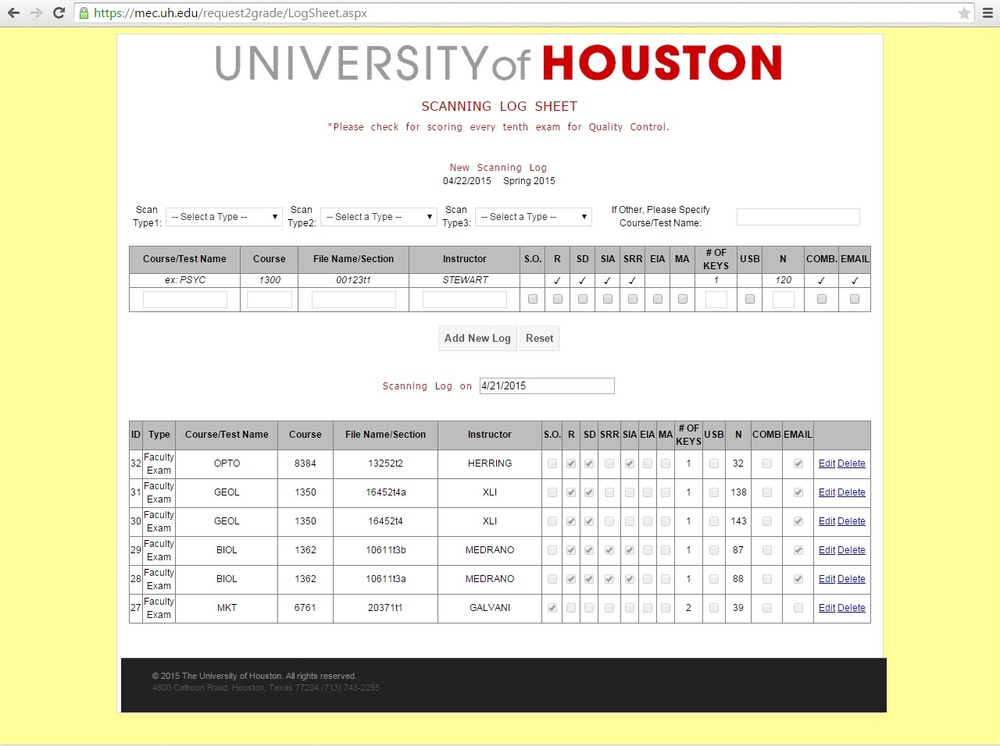

[ASP.NET](#ASPNET) 
[IOS](#IOS) 
[Java](#Java)

***
##ASP.NET Development
---

###Online Course Evaluation Report
_Apr. 2015 - Present_ | __C#/Visual Studio/SQL Server__

It is a project for Mesurement Evaluation Center, University of Houston. 
It is an ASP.NET Web Forms application to generate online course evaluation report for all the faculties and students. 
I implement following parts:

- Generate Online Course Evaluation Report with various questionaire from different colleges/departments.
- Implement access control policy by Session State.

 
###Log Sheet

_Apr. 2015_ | __C#/Visual Studio/SQL Server__

It is a project for Mesurement Evaluation Center, University of Houston. 
It is an ASP.NET Web Forms application to manage the scaning log. 
I implement following parts:

- A GridView to insert, edit and delete records of scaning log.
- Validate data in code behind file, when insert or edit records.

***
##IOS Development
---

###FaceLock
_Mar. 2015 - May 2015_ | __Objective-C/Xcode/OpenCV__

It is a Computer Vition class project. There are four members in the group. 
It is an ISO application that implement 2D and 3D face detection and recogenition.  
I implement following parts:

- IU. Implement with TableView, CollectionView, UIImageView.
- 2D face recognition based on LBPH algrithm.

***
##Java Development
---

###MapReduce Projects
_Feb. 2015 - May 2015_ | __Java/Eclipse/Hadoop/MapReduce__ 

__1. WordCount__

- Analyze the log from stackexchange.com, to compare average score of accepted answers with unaccepted answers. Input file is more than 10GB, and running time is less than 5 minutes.
-	Use Java and MapReduce library, and implement Chained MapReduce jobs.

__2. Hbase__

- Phase log from stackexchange.com, and perform a bulk import of the data in Hbase.
- Calculates the average number of answers per question from data in Hbase.

__3. Simple Search Engine__

- Analyze multiple thousand books as raw text files, we will build a simple search engine for identifying the most relevant books from given a search term. 
- Implement an inverted index.
- Build a simple retriever.
