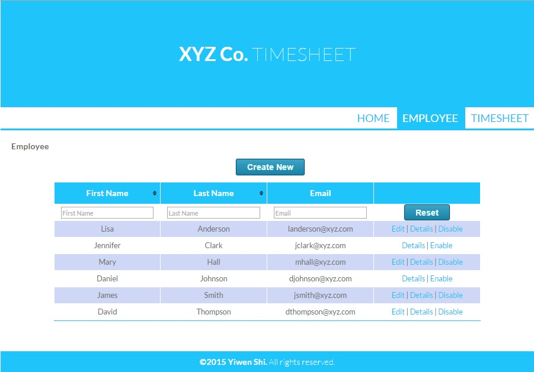
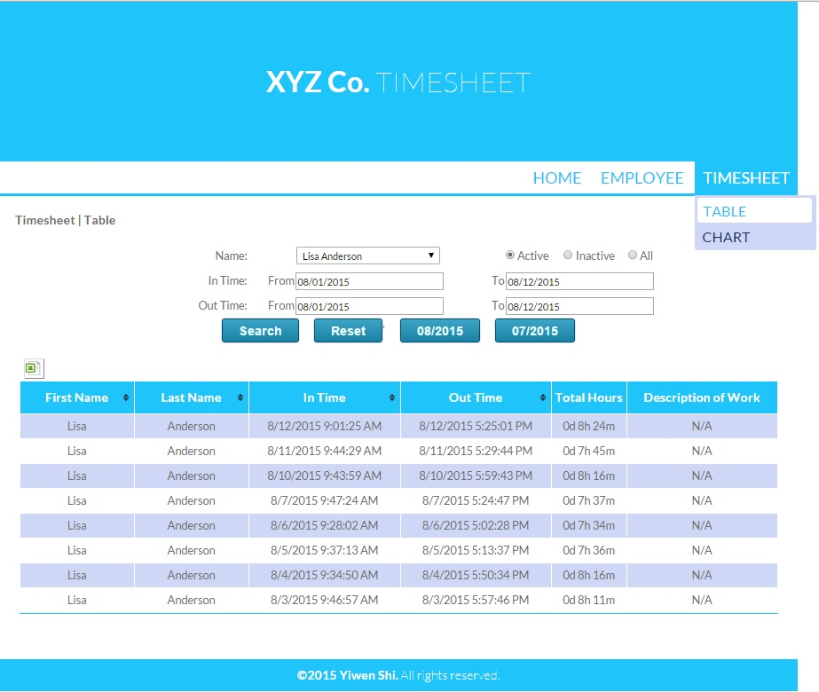
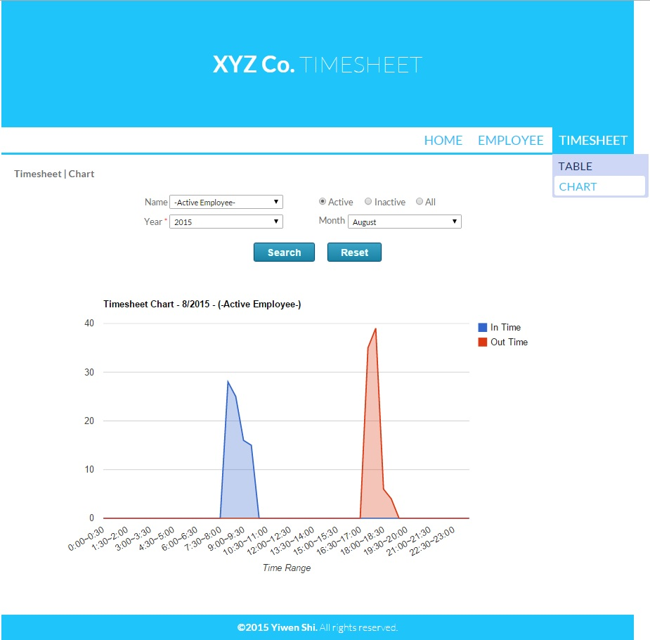

[ASP.NET](#ASPNET) 
[IOS](#IOS) 
[Java](#Java) 
[Matlab](#Matlab)

***
##ASP.NET Development
---

###Timesheet System ([Demo](http://timesheetdemo.somee.com)) 
_Jun. 2015 - Aug. 2015_| __C# / ASP.NET MVC4 / Entity Framework / CSS / jQuery__

It is an ASP.NET MVC application to manage employee’s personal information and work attendance.  
I implement following parts:

- Models of employee management, attendance management with ASP.NET MVC4 and Database First development using Entity Framework.
- UI and interactive tables enable sort and filter by multiple key words with CSS and jQuery.

	<ul class="imgStyle"> 
	   	<li class="imgStyle"></li>
	    <li class="imgStyle"></li>
	   	<li class="imgStyle"></li>
	    <li class="imgStyle"></li>
	    <li class="imgStyle"></li>
	</ul>

 

###Online Course Evaluation Report
_Apr. 2015 - Present_ | __C# / Visual Studio / SQL Server__

It is a project for Measurement Evaluation Center, University of Houston. 
It is an ASP.NET Web Forms application to generate online course evaluation report for all the faculties and students. 
I implement following parts:

- Generate Online Course Evaluation Report with various questionnaires from different colleges/departments.
- Implement access control policy by Session State, to guarantee faculties can only view the report they authorized.

	<ul class="imgStyle"> 
	   	<li class="imgStyle"></li>
	    <li class="imgStyle"></li>
	</ul>

###Log Sheet

_Apr. 2015_ | __C# / Visual Studio / SQL Server__

It is a project for Measurement Evaluation Center, University of Houston. 
It is an ASP.NET Web Forms application to manage the scanning log. 
I implement following parts:

- A GridView to insert, update, delete and validate records of scanning log. 

***
##IOS Development
---

###FaceLock
_Mar. 2015 - May 2015_ | __Objective-C / Xcode / OpenCV__

It is a Computer Vition class project. There are four members in the group. 
It is an ISO application that implements 2D and 3D face detection and recognition.  
I implement following parts:

- IU. Implement with TableView, CollectionView, UIImageView.
- 2D face recognition based on LBPH algorithm.

	<ul class="imgStyle"> 
	   	<li class="imgStyle"></li>
	    <li class="imgStyle"></li>
	   	<li class="imgStyle"></li>
	    <li class="imgStyle"></li>
	    <li class="imgStyle"></li>
	</ul>

***
##Java Development
---

###MapReduce Projects
_Feb. 2015 - May 2015_ | __Java / Eclipse / Hadoop / MapReduce / Hbase__ 

__1. WordCount__

- Analyze the log from stackexchange.com, to compare average score of accepted answers with unaccepted answers. Input file is more than 10GB, and running time is less than 5 minutes.
-	Use Java and MapReduce library, and implement Chained MapReduce jobs.

__2. Hbase__

- Phase log from stackexchange.com, and perform a bulk import of the data in Hbase.
- Calculates the average number of answers per question from data in Hbase.

__3. Simple Search Engine__

- Analyze multiple thousand books as raw text files, we will build a simple search engine for identifying the most relevant books from given a search term. 
- Implement an inverted index.
- Build a simple retriever.

***
##Matlab Development
---

###Classification of U.S. Coins
_Nov. 2014 - Dec. 2014_ | __Matlab / Image Processing__ 

It is a Digital Image Processing class project. There are five members in the group. 
This is a Matlab model to find out the total value of coins in the image.
 
I implement following parts: 

- Implement image-processing algorithms (color segmentation, circle Hough transformation) to extract coins’ feature.

	<ul class="imgStyle"> 
	   	<li class="imgStyle"></li>
	    <li class="imgStyle"></li>
	</ul>

